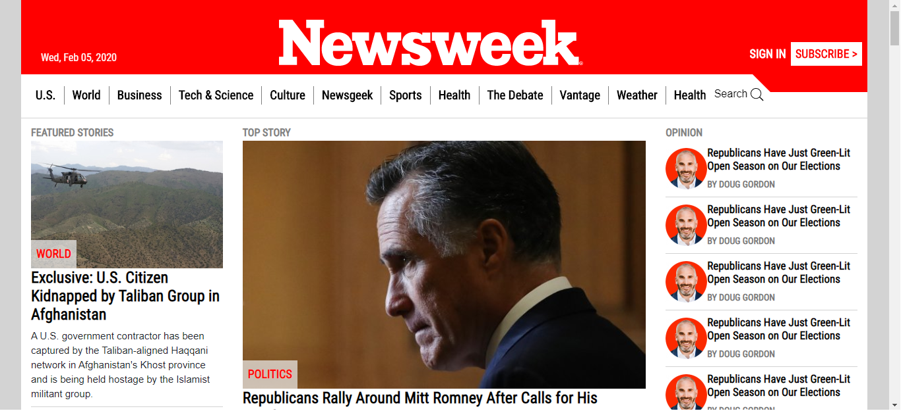
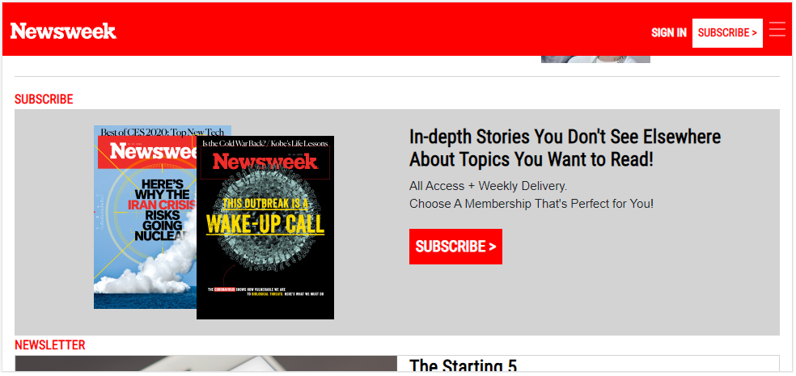

# A responsive [Newsweek.com](www.newsweek.com) clone using [Bootstrap](https://getbootstrap.com/)

> In this project, I got to try out Twitter’s Bootstrap framework by building a site that actually uses it – Newsweek.

## Desktop view

## Tablet view

## Mobile view

## Built With

- HTML5
- CSS3
- Twitter Bootstrap

## Live Demo

[Live Demo Link](https://rawcdn.githack.com/voscarmv/using_bootstrap/0e59f9b09110f7d4e7ef9a56a95bc85d395defa2/index.html)

## Getting Started

**The elements on the webpage don't work. It's only to showcase my HTML/CSS coding skills.**

## Author

**Oscar Mier**
- Github: [@voscarmv](https://github.com/voscarmv)
- Twitter: [@voscarmv](https://twitter.com/voscarmv)
- Linkedin: [Oscar Mier](https://www.linkedin.com/in/oscar-mier-072984196/) 

## 🤝 Contributing

Contributions, issues and feature requests are welcome!

Feel free to check the [issues page](../../issues/).

## Show your support

Give a ⭐️ if you like this project!

## Acknowledgments

- Hat tip to anyone whose code was used
- Thanks to [Microverse](https://www.microverse.org/?grsf=xb25xf)
- Thanks to [The Odin Project](https://www.theodinproject.com/)
- Thanks to [Newsweek](www.newsweek.com) for letting us clone it's homepage!

## 📝 License

This project is [MIT](https://opensource.org/licenses/MIT) licensed.
